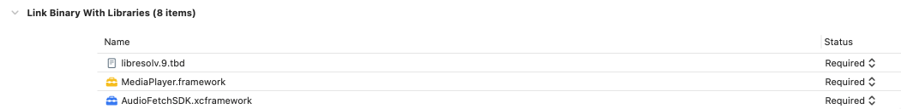
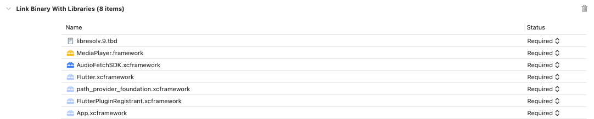
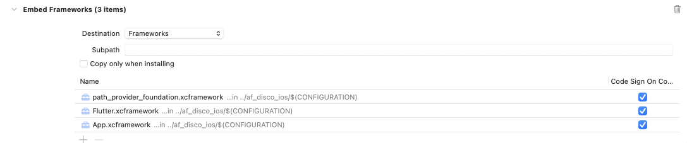

# AudioFetch iOS SDK Sample

## Overview

This is an example app for how to integrate and use the v3 AudioFetch SDK. The SDK
now takes the form of two libraries: audio and discovery.

The discovery library, afDisco, is responsible for discovering AudioFetch boxes on the local network and returning a list of available channels after the discovery process is complete.

The audio library, afAudio, is responsible for playing the audio from the discovered boxes.

This sample assumes that the afDisco distribution is a peer of this directory:

    af-sdk-sample-ios
    af-disco-ios

You can, of course, organize in any way you wish, but the relative paths in the XCode integration of the frameworks from the afDisco lib assume this structure for this sample app. The afAudio library takes the form of framework that is included in AudioFetchSDK here for convienence.

## Building and Running

With the above directory structure, open the workspace in XCode, then build and run. This sample app will show a list of channels and allow you to play and pause.

This app is intended to be a minimal example app to show the integration of the AudioFetch SDK.

## Integrating afAudio into your App

Add the afAudio XCFramework in Build Phases > Link Binary with LIbraries:

Additionally add the libresolv and MediaPlayer frameworks as shown above.

In Build Options, set User Script Sandboxing to NO.

In Other Linker Flags, add -lc++.

If using Cocoapods as this sample app does, set Build Active Archictures to NO for both debug and release for the Pods project in XCode.

## Integrating afDisco into your App

The afDisco library is re-written in v3 for improved performance and stability, and is implemented in Dart and uses a Flutter method channel for communication between the afDisco library and the host app. Note that while Flutter is used, it is only used for the method channel, not for any user interface elements, etc.

As with afAudio above, add the frameworks in Build Phases > Link Binary with Libraries:

There are 4 frameworks to pull in, the last 4 in above. 

Additionally also in Build Phases, these frameworks need to be embedded:

In Build Phases > Search Paths, two items need to be added to Framework Search Paths:

​    $(inherited)

​    $(PROJECT_DIR)/Flutter/$(CONFIGURATION)/

For in-depth information about integrating Flutter frameworks into a host app: https://docs.flutter.dev/add-to-app/ios/project-setup

Additionally, you must request and enable the Multicast Entitlement from Apple as described in the next section.

## Request Multicast Entitlement from Apple

The Discovery SDK uses local broadcast and multicast UDP packets to discovery AudioFetch boxes on the local network. In recent iOS releases, Apple now requires a special entitlement for each App that sends these UDP packets, and so you must request this entitlement from Apple.

Note that this SDK sample does not have this entitlement, which allows it to run in a Simulator fine, but discovery may fail on a real device because of this.

For more information:

https://developer.apple.com/documentation/bundleresources/entitlements/com_apple_developer_networking_multicast

https://forums.developer.apple.com/forums/thread/663271

## afDisco Integration

The sample app uses SwiftUI, and the AFSDKSampleApp.swift file contains the integration and communication with afDisco.

Imports:

    // Imports for AFDisco Lib
    import Flutter
    import FlutterPluginRegistrant
    

In init(), instantiate the Flutter Engine and create the method channel for communication:

        // Start AFDisco
        afDiscoEngine.run()
        GeneratedPluginRegistrant.register(with: self.afDiscoEngine);
        
        // Initialize method channel for AFDisco
        self.setupMethodChannel()
        
          func setupMethodChannel() {
           // setup a method channel
            let controller = FlutterViewController(engine: afDiscoEngine, nibName: nil, bundle: nil)
            afDiscoChannel = FlutterMethodChannel(name: "com.audiofetch/afDisco", binaryMessenger: controller.binaryMessenger)
        
            // set up method call handler to receive data from AFDisco
            afDiscoChannel!.setMethodCallHandler({
            	...
            })
          }
    

The method call handler then receives messages from the afDisco module, details below in the API section.

## afAudio Integration

In init(), start the audio service.

For the SDK, host apps do this on startup and leave the audio service running for the duration of the app's lifecycle.

    // Start AFAudio Service
    audio.startService()

## SDK API

For discovery, messages over the method channel take the form of a message with parameters. the "newDisco" and "discoResults" messages have json as their parameters.

    -> afDiscoUp       from afDisco to Host
    <- startDisco      from Host to afDisco
    -> newDisco        from afDisco to Host
    -> discoResults    from afDisco to Host

The newDisco message is sent incrementally during discovery as new boxes (APB's) are found. These have raw information about boxes, but can be ignored. The discoResults message contans a json map of all channels found during the discovery period which lasts 6 seconds. The json is organized by "UI Channel Number", which is the channel number displayed in the AudioFetch listening app, where boxes configured as "Box A" have Channels starting at 1.

The sample app parses this json map of channels and translates that into a string list for display as a scrolling list in the app. It also keeps track of the APB ip address and raw APB channel for that UI Channel so that it may call setApbAndChannel() in the audio API (below).

For audio:

    audio.startService()
    audio.startAudio( apbIp, apbChannelNum )
    audio.muteAudio()
    audio.unmuteAudio()

In the sample app, tapping "Play" or "Pause" mutes or umutes the audio. While the UI says "Pause", the real-time audio stream from the box of course keeps going, so in implementation, the SDK is muting the audio from that stream.

